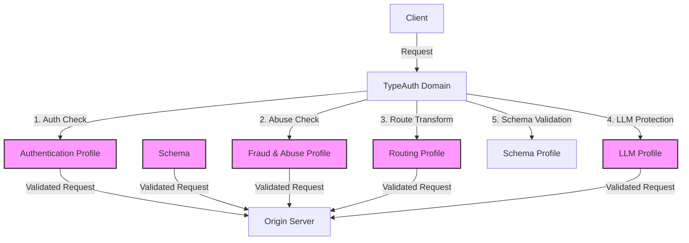

Applications are the cornerstone of TypeAuth's architecture. They serve as the primary configuration point where you define how your API traffic should be handled, secured, and routed.

## Basic Configuration

Every TypeAuth application requires these fundamental settings:

### Core Settings

- **Name**: Unique identifier for your application
- **Origin Hostname**: The destination where TypeAuth forwards traffic (e.g., `api.yourcompany.com`)
- **Domain**: Your TypeAuth-provided domain for client access
  - Format: `api1-{account_slug}-proxy.typeauth.com`
  - Example: `api1-acme-proxy.typeauth.com`
- **Auth ID**: Authentication profile ID

### Creating an Application

#### Via Dashboard
1. Navigate to Applications
2. Click "Create New Application"
3. Fill in the required settings
4. Save configuration

#### [Via API](https://docs.typeauth.com/api-reference/applications/create-a-new-application)
```http
POST /{account_id}/applications/create
Content-Type: application/json

{
  "name": "payment-api",
  "origin_hostname": "api.paymentservice.com",
  "description": "Production API in AWS"
  "domain": "payments-123456789.typeauth.com"
  "tags": [
    "customer1", "production"]
  "auth_id": "123456789"
}
```

## Profile Attachments

Applications can be enhanced by attaching various profiles:

### Available Profiles

1. **Authentication Profiles**
   - API Key validation
   - JWT validation settings
   - Token Rate limiting
   - Expiration

2. **Routing Profiles**
   - URL transformation rules
   - Path modifications
   - Header management

3. **Fraud & Abuse Profiles**
   - Rate limiting rules
   - Threat detection

4. **LLM (Language Model) Profiles**
   - AI content filtering
   - Prompt injection protection
   - Response validation
5. **Schema Validation Profiles**
   - Upload a OpenAPIv3 schema
   - Allow/deny traffic based on that schema

### Attaching Profiles

#### Via Dashboard
1. Select your application
2. Navigate to desired profile section
3. Choose profile to attach
4. Save changes

#### [Via API](https://docs.typeauth.com/api-reference/applications/update-application)
```http
PATCH /{account_id}/applications/{application_id}
Content-Type: application/json

{
  "auth_id": "auth-prof-123",
  "abuse_id": "route-prof-456",
  "routing_id": "fraud-prof-789",
  "llmcache_id": "llm-prof-012",
  "schema_id": "schema-652"

}
```

## Application Architecture

[Diagram Placeholder]



## Best Practices

1. **Profile Organization**
   - Create separate profiles for different environments
   - Use consistent naming conventions
   - Document profile purposes

2. **Security**
   - Always attach authentication profiles
   - Configure fraud protection for public APIs
   - Regularly review security settings

3. **Maintenance**
   - Regularly review attached profiles
   - Remove unused profile attachments
   - Keep profile configurations up to date


## Monitoring

- **Traffic Overview**: Monitor request patterns
- **Profile Performance**: Track profile effectiveness
- **Error Rates**: Monitor rejection rates
- **Latency Impact**: Track processing overhead

## Limitations

- Maximum 50 applications per account
- Up to 5 tags per application
- One profile of each type per application
- Domain name character limit: 63

## Need Help?

For assistance with application configuration or profile management, please contact our support team or refer to our API documentation for detailed examples.
